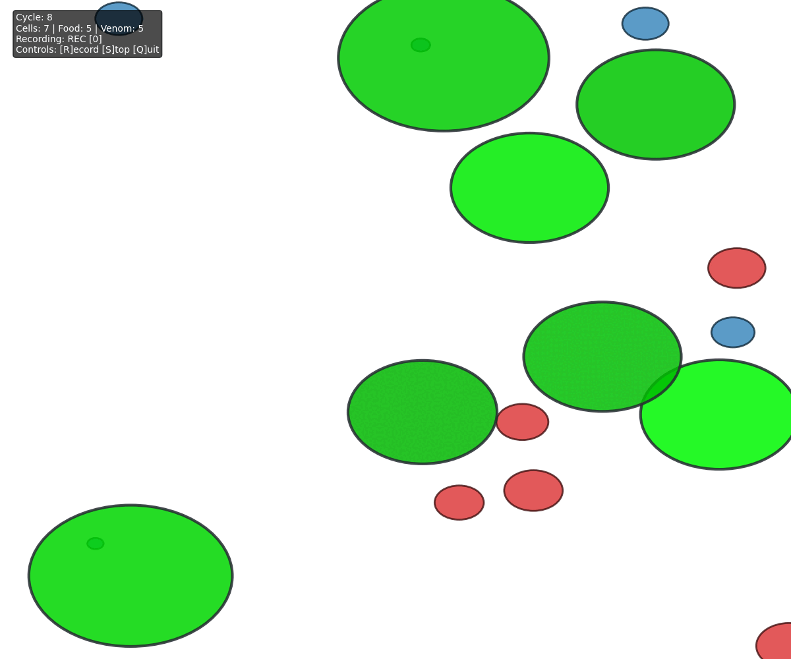

# SaGa-GenAI

**Biologically-inspired multi-agent simulation using LLMs and scalable architecture**

SaGa-GenAI is an artificial life simulation where autonomous cells navigate a 2D universe, seeking food and avoiding venom to survive and reproduce. The project explores emergent behavior by giving each cell its own decision-making capabilities through Large Language Models (LLMs), creating a framework for studying artificial evolution and collective intelligence.



## Project Vision

### What It Does

SaGa-GenAI simulates a living ecosystem where:

- **Cells** are autonomous agents that move, consume energy, and reproduce
- **Food** provides energy for survival and growth
- **Venom** poses dangers that cells must avoid
- Each entity interacts through physical proximity in a 2D space
- The simulation supports hundreds of cells with spatial optimization

### What It Aims to Do

The ultimate goal is to create a **true multi-agent system** where:

- **Each cell is powered by its own LLM agent** with individual decision-making capabilities
- Cells develop unique survival strategies through learning and adaptation
- Emergent behaviors arise from collective intelligence without centralized control
- The architecture scales to support large populations of LLM-driven agents
- Cells can potentially communicate, cooperate, or compete based on learned behaviors

Currently, the project uses rule-based movement (path-finding toward food, random wandering), but the infrastructure for LLM-based agents is already in place via the `llm_based_cell_movement()` function in `src/agents.py`.

## 🚀 Getting Started

### Prerequisites

- Python 3.12+
- [uv](https://github.com/astral-sh/uv) package manager

### Installation

```bash
# Clone the repository
git clone https://github.com/dgcmain/saga-genai.git
cd saga-genai

# Install dependencies
uv sync
```

### Running the Simulation

Basic usage:
```bash
uv run src/main.py
```

Custom simulation parameters:
```bash
uv run src/main.py --width 2000 --height 1500 --cells 50 --food 30 --venom 20
```

Performance mode (for large simulations):
```bash
uv run src/main.py --update-every 4 --batch-size 200 --no-scatter
```

### Recording Videos

High-quality recording:
```bash
uv run src/main.py --record --record-quality 10 --record-fps 60 --record-format mp4
```

Interactive recording:
- Press `R` to start recording
- Press `S` to stop recording
- Press `Q` to quit

Convert to GIF
```
# First convert to individual frames
ffmpeg -i simulation.mp4 frame_%04d.png

# Then create GIF
convert -delay 10 -loop 0 frame_*.png output.gif

# Clean up frames
rm frame_*.png
```


## 🏗️ Architecture

### Core Components

- **`Cell`** (`src/cell.py`): The autonomous agent with metabolism, movement, and reproduction
- **`Universe`** (`src/universe.py`): The simulation environment with spatial partitioning for performance
- **`Food` & `Venom`** (`src/entities.py`): Interactive resources in the environment
- **`Renderer`** (`src/render.py`): Real-time visualization with video recording capabilities
- **`Agent`** (`src/agents.py`): LLM-based decision-making system (currently not active by default)

### Key Features

- **Spatial Optimization**: Grid-based partitioning for efficient collision detection
- **Energy Economy**: Closed-loop energy system with metabolism, consumption, and degradation
- **Genetic Variation**: Color mutations inherited through reproduction
- **Performance Tuning**: Multiple rendering modes and batch processing
- **Real-time Recording**: High-quality video export during simulation

## 🛠️ Development

### Project Structure

```
saga-genai/
├── src/
│   ├── main.py          # Entry point with CLI
│   ├── universe.py      # Simulation engine
│   ├── cell.py          # Cell agent implementation
│   ├── entities.py      # Food and venom entities
│   ├── agents.py        # LLM agent integration
│   ├── render.py        # Visualization and recording
│   └── tools.py         # Utility functions
├── pyproject.toml       # Dependencies
└── README.md
```

### Making Changes

1. **Fork and clone** the repository
2. **Create a feature branch**: `git checkout -b feature/your-feature-name`
3. **Make your changes** following the existing code style
4. **Test thoroughly** with different simulation parameters
5. **Commit with clear messages**: `git commit -m "Add feature: description"`
6. **Push and create a pull request**: `git push origin feature/your-feature-name`

### Code Style

- Use type hints for function parameters and returns
- Follow dataclass patterns for entity definitions
- Keep functions focused and well-documented
- Optimize for performance in simulation loops
- Add docstrings to public methods

### Testing Your Changes

Run simulations with various configurations:

```bash
# Small simulation for quick testing
uv run src/main.py --cells 10 --food 5 --venom 5

# Large simulation for stress testing
uv run src/main.py --cells 100 --food 50 --venom 30 --width 2000 --height 2000

# Performance profiling
uv run src/main.py --update-every 1 --no-scatter
```

## 🗺️ Roadmap

### Phase 1: LLM Agent Integration and Environment

- [x] Basic LLM integration framework (`agents.py`)
- [ ] Enable LLM-based movement by default
- [ ] Optimize LLM inference for real-time simulation (Groq, Cerebras ...)
- [ ] Implement agent memory and learning
- [ ] Add context-aware decision making (hunger, danger awareness)

- [ ] Change renderer to Threejs
- [ ] Add context-aware decision making (hunger, danger awareness)


### Phase 2: Advanced Agent Behaviors

- [ ] Multi-turn reasoning for complex decisions
- [ ] Interactive agent control (human-in-the-loop)
- [ ] War game between cells (Multi Agent wars)

- [ ] Cell-to-cell communication protocols
- [ ] Social behaviors (cooperation, competition)
- [ ] Tool use (cells modifying their environment)
- [ ] Specialization and role differentiation

### Phase 3: Scalability & Performance

- [ ] Distributed LLM inference for large populations
- [ ] Asynchronous agent processing
- [ ] Caching and optimization for repetitive decisions
- [ ] Support for 1000+ concurrent LLM agents
- [ ] GPU acceleration for physics and rendering

### Phase 4: Evolution & Learning

- [ ] Genetic algorithms for strategy evolution
- [ ] Neural network integration for hybrid agents
- [ ] Reinforcement learning from simulation outcomes
- [ ] Population-level adaptation tracking
- [ ] Survival strategy analysis tools

### Phase 5: Ecosystem Complexity

- [ ] Multiple cell species with different strategies
- [ ] Environmental dynamics (seasons, disasters)
- [ ] Resource scarcity and abundance cycles
- [ ] Predator-prey relationships
- [ ] Symbiosis and parasitism

### Future Explorations

- 3D environment expansion
- Multi-universe simulations (parallel worlds)
- Agent introspection and self-modification
- Emergence of language and culture

## 🤝 Contributing

We welcome contributions of all kinds:

- **Bug reports**: Open an issue with reproduction steps
- **Feature requests**: Describe the capability you'd like to see
- **Code contributions**: Follow the development workflow above
- **Documentation**: Improve explanations and examples
- **Performance optimizations**: Help scale to larger simulations

### Areas Needing Help

- **LLM optimization**: Making agent inference fast enough for real-time use
- **Advanced Rendering**: Threejs or Game Engines integration (Godot, Unity)
- **Agent prompting**: Crafting effective prompts for cell decision-making
- **Visualization**: New ways to display agent behavior and statistics
- **Analysis tools**: Measuring emergence, diversity, and evolution

## 📝 License

MIT License
Copyright (c) 2025 SaGa-GenAI Contributors
Permission is hereby granted, free of charge, to any person obtaining a copy
of this software and associated documentation files (the "Software"), to deal
in the Software without restriction, including without limitation the rights
to use, copy, modify, merge, publish, distribute, sublicense, and/or sell
copies of the Software, and to permit persons to whom the Software is
furnished to do so, subject to the following conditions:
The above copyright notice and this permission notice shall be included in all
copies or substantial portions of the Software.
THE SOFTWARE IS PROVIDED "AS IS", WITHOUT WARRANTY OF ANY KIND, EXPRESS OR
IMPLIED, INCLUDING BUT NOT LIMITED TO THE WARRANTIES OF MERCHANTABILITY,
FITNESS FOR A PARTICULAR PURPOSE AND NONINFRINGEMENT. IN NO EVENT SHALL THE
AUTHORS OR COPYRIGHT HOLDERS BE LIABLE FOR ANY CLAIM, DAMAGES OR OTHER
LIABILITY, WHETHER IN AN ACTION OF CONTRACT, TORT OR OTHERWISE, ARISING FROM,
OUT OF OR IN CONNECTION WITH THE SOFTWARE OR THE USE OR OTHER DEALINGS IN THE
SOFTWARE.


## 📧 Contact

https://www.linkedin.com/in/davidgarciacorrochano/

---

**Note**: This project is under active development. The LLM agent system is currently in experimental stages. Expect breaking changes as we evolve the architecture toward true multi-agent intelligence.